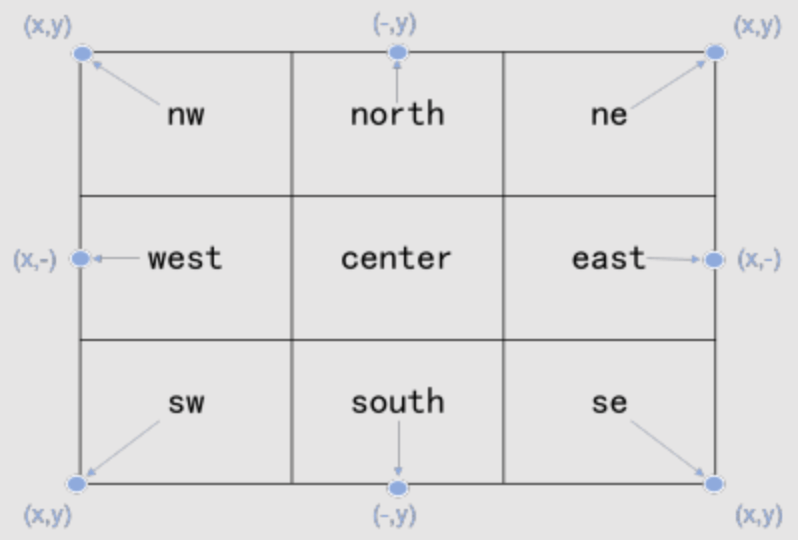

# 使用(Usage)

## 1. 图像处理参数

- 斜线 `/` 隔开，区分不同的操作；
- 逗号 `,` 隔开，区分操作中不同的参数；
- 下划线 `_` 隔开，`key_value` 的形式，区分参数的Key和Value；
- `value`是复杂参数时，需要进行`base64url_encode`，是否需要encode查看文档参数详细说明；

### 1.1 图像保存时需要的参数
| 参数 | 必选 | 描述 | 取值范围 |
| - |  - |  - |  - |
| format | 否 | 格式转换 | jpeg png webp |
| quality | 否 | 质量变换 | [1,100] 默认值：`settings.PROCESSOR_DEFAULT_QUALITY`（75） 支持JPG和WebP |
| interlace | 否 | 渐进显示 | `0`：（默认值）表示将原图设置成标准显示 `1`：表示将原图设置成渐进显示 |

> 注意：多个操作key放在一起说明，使用都需要`/`隔开；从1.2开始都是单个操作说明；

示例：

- `format,webp` `webp`能节省图像大小；
- `format,png` 需要透明度使用`png`格式；
- `interlace,1/quality,70/format,jpeg` 设置为质量75渐近显示的jpeg图像

### 1.2 缩放 `resize`
| 参数 | 必选 | 描述 | 取值范围 |
| - |  - |  - |  - |
| m | 否 | 缩放模式，需设置`w`或`h`才会生效 | `lfit`(默认值) 等比缩放，缩放图限制为指定w与h的矩形内的最大图像 `mfit` 等比缩放，缩放图为延伸出指定w与h的矩形框外的最小图像 `fit` 将原图等比缩放为延伸出指定w与h的矩形框外的最小图像，然后将超出的部分进行居中裁剪 `pad` 将原图缩放为指定w与h的矩形内的最大图像，然后使用指定颜色居中填充空白部分 `fixed` 固定宽高，强制缩放 参照枚举 [ResizeMode](./#enums.ResizeMode) |
| w | 否 | 目标缩放图的宽度 | [1, `settings.PROCESSOR_MAX_W_H`] |
| h | 否 | 目标缩放图的高度 | [1, `settings.PROCESSOR_MAX_W_H`] |
| l | 否 | 目标缩放图的最长边，优先级低于`w、h`配置 | [1, `settings.PROCESSOR_MAX_W_H`] |
| s | 否 | 目标缩放图的最短边，优先级低于`l`配置 | [1, `settings.PROCESSOR_MAX_W_H`] |
| p | 否 | 按百分比缩放图像，优先级低于`s`配置 | [1, 1000] 小于100为缩小，大于100为放大 |
| limit | 否 | 当目标图像分辨率大于原图分辨率时，是否进行缩放 | `1` (默认值)不放大 `0` 按照指定参数进行缩放 |
| color | 否 | 填充的颜色，仅当`m=pad`时有效 | 默认值：FFFFFF（白色）|

 注意：`settings.PROCESSOR_MAX_W_H` 默认值为 `30000`。

示例：

- `resize,m_fixed,w_1000,h_1000,l_700` 其中`l`优先级低不会生效，原图1980x1080会强制缩放成1000x1000的图像

### 1.3 裁剪 `crop`
| 参数 | 必选 | 描述 | 取值范围 |
| - |  - |  - |  - |
| x | 否 | 裁剪起点横坐标（默认左上角为原点） | [0, 图像边界]，默认为0 |
| y | 否 | 裁剪起点纵坐标 | [0, 图像边界]，默认为0 |
| w | 否 | 目标图的宽度 | [1, 图像宽度]，默认为最大值 |
| h | 否 | 目标图的高度 | [1, 图像高度]，默认为最大值 |
| ratio | 否 | 根据原图按照比例计算目标宽高； 优先级高于`w、h` | 格式：`w:h`，eg: `4:3` |
| g | 否 | 按照九宫格的位置裁剪 | 见下图所示 |
| pf | 否 | `xywh`相应字段按照比例计算； 设置后相应字段取值范围为[1,100]； 设置了`g`该参数无效 | `xywh`4个字母的任意组合 |
| padr | 否 | 图像右边裁边 | [1, 图像宽度]，不设置不裁边 |
| padb | 否 | 图像底部裁边 （左和上裁边可以通过x,y控制） | [1, 图像高度]，不设置不裁边 |

示例：

- `crop,ratio_4:3,g_center` 原图是500x300会居中裁剪成400x300
- `crop,x_25,y_25,w_50,h_50,pf_xywh` 原图是500x400根据百分比计算，会居中裁剪成250x200
- `crop,x_10,y_10,padr_10,padb_10` 原图四周裁剪10像素

### 1.4 圆角 `circle`
| 参数 | 必选 | 描述 | 取值范围 |
| - |  - |  - |  - |
| r | 否 | 将图像切出圆角，指定圆角的半径 没有设置或是超过最大内切圆的半径，按照最大内切圆的半径处理 | [1, 图像边界] |

> 注意：一般结合`format,png`使用，否则无透明度；

示例：

- `circle/format,png` 不设置r值，原图800x800，会裁剪成圆形，尺寸还是800x800；
- `circle,r_10/format,png` 原图800x800，原图四角有半径为10的圆角；
- `circle,r_1000/format,png` 原图800x800，r值超过边界，结果输出圆形图像；

### 1.5 模糊效果 `blur`
| 参数 | 必选 | 描述 | 取值范围 |
| - |  - |  - |  - |
| r | 是 | 高斯模糊半径，值越大图像越模糊 | [1, 50] |

示例：

- `blur,r_2`

### 1.6 旋转 `rotate`
| 参数 | 必选 | 描述 | 取值范围 |
| - |  - |  - |  - |
| [value] | 否 | 图像按顺时针旋转的角度 | [0,360] 默认值：0，表示不旋转 |

> 注意：该操作参数无key，直接逗号后跟数值即可

示例：

- `rotate` 相当于 `rotate,0`，不旋转
- `rotate,90` 图像顺时针旋转90度
- `rotate,45` 图像顺时针旋转45度，会改变原有图像宽高比

### 1.7 透明度 `alpha`
| 参数 | 必选 | 描述 | 取值范围 |
| - |  - |  - |  - |
| [value] | 否 | 图像的不透明度 | [0,100] 默认值：100，完全不透明 |

> 注意：该操作参数无key，直接逗号后跟数值即可；若原图非`png`图像，需结合`format,png`使用

示例：

- `alpha` 相当于 `alpha,100`，完全不透明
- `alpha,0` 图像完全透明
- `alpha,50/format,png` 图像透明度50%

### 1.8 灰度图 `gray`

无任何参数

示例：

- `gray` 图像会置灰
- `gray/format,jpeg/quality,75` 一般会结合转换成jpeg并设置质量减少原图大小（非强制）

### 1.9 水印 `watermark`
| 参数 | 必选 | 描述 | 取值范围 |
| - |  - |  - |  - |
| x | 否 | 水印在原图上的起点横坐标 | [0, 图像边界] 默认 `10` |
| y | 否 | 水印在原图上的起点纵坐标 | [0, 图像边界] 默认 `10` |
| g | 否 | 按照九宫格计算水印的位置，优先级高于`x、y` | |
| pf | 否 | `xywh`相应字段按照比例计算； 设置后相应字段取值范围为[1,100]； 设置了`g`该参数无效 | `xywh`4个字母的任意组合 |
| fill | 否 | 水印铺满原图 | `0` (原图) 不铺满 `1` 铺满全图 |
| padx | 否 | 平铺时单个水印间的水平间隔，仅在水印平铺开启时有效 | [0,4096]，默认 `0` |
| pady | 否 | 平铺时单个水印间的垂直间隔，仅在水印平铺开启时有效 | [0,4096]，默认 `0` |
| image | 是 | 图片水印的文件路径，需 [base64url_encode](./#utils.base64url_encode) 编码 |
| text | 是 | 文字水印内容，text和image必须传递一个 需 [base64url_encode](./#utils.base64url_encode) 编码 | 编码前文字内容长度不超过 `64` |
| font | 否 | 字体文件路径，需 [base64url_encode](./#utils.base64url_encode) 编码 | |
| color | 否 | 字体颜色 | 默认：000000 (黑色) |
| size | 否 | 字体大小 | 默认：40 |
| shadow | 否 | 文字水印的阴影透明度 | [0,100] 默认值：0，表示没有阴影 |
| rotate | 否 | 水印顺时针旋转角度 | [0,360] 默认值：0，表示不旋转 |
| order | 否 | 文字和图片水印的前后顺序 | 0（默认值）：表示图片水印在前 1：表示文字水印在前 see [PositionOrder](./#enums.PositionOrder) |
| align | 否 | 文字和图片水印的对齐方式 | 0：表示文字水印和图片水印上对齐 1：表示文字水印和图片水印中对齐 2（默认值）：表示文字水印和图片水印下对齐 3：垂直左对齐 4：垂直居中对齐 5：垂直右对齐  see [PositionAlign](./#enums.PositionAlign) |
| interval 否 | | 文字和图片水印间的间距 | [0,1000]，默认值：0；单位：px |
| t | 否 | 水印的不透明度 | [0, 100]，100不透明 |
| design | 否 | 水印尺寸的设计参照尺寸； design=1000意思是水印按照短边1000图像设计的； 需参照图像和design的比例进行缩放水印 | 当design=1000，若水印100x100，原图1080x720，则将水印缩放为72x72 |

示例：

- `watermark,text_SGVsbG8g5LiW55WM,color_FFFFFF,size_80` 文字水印其中`SGVsbG8g5LiW55WM`是`Hello 世界`编码后的

### 1.10 合并图像 `merge`
| 参数 | 必选 | 描述 | 取值范围 |
| - |  - |  - |  - |
| image | 是 | 要参与合并的图像文件路径，需 [base64url_encode](./#utils.base64url_encode) 编码 | |
| action | 否 | 对`iamge`图像按照字符串参数进行预处理，需 [base64url_encode](./#utils.base64url_encode) 编码 |
| p | 否 | 按图像的百分比缩放`image`图像 | [1, 1000] 小于100为缩小，大于100为放大 |
| order | 否 | 图像和`image`的前后顺序 | 0：该image在后 1：该image在前 不传递该参数align和interval不生效 see [PositionOrder](./#enums.PositionOrder) |
| align | 否 | 图像和`image`的对齐方式 | 0：水平上对齐 1：水平居中对齐 2（默认值）：水平下对齐 3：垂直左对齐 4：垂直居中对齐 5：垂直右对齐 see [PositionAlign](./#enums.PositionAlign) |
| interval 否 | | 图像和`image`间的间距 | [0,1000]，默认值：0；单位：px |
| x | 否 | `image`在图像上的起点横坐标 | [0, 图像边界] 默认 `0` |
| y | 否 | `image`在图像上的起点纵坐标 | [0, 图像边界] 默认 `0` |
| g | 否 | 按照九宫格计算水印的位置，优先级高于`x、y` | |
| pf | 否 | `xy`相应字段按照比例计算； 设置后相应字段取值范围为[1,100]； 设置了`g`该参数无效 | `xy`2个字母的任意组合 |
| color | 否 | 拼接后扩展部分的填充颜色 | 默认： FFFFFF (白色) |

示例：

- `merge,image_dGVzdHMvaW1ncy9sZW5uYS00MDB4MjI1LmpwZw,g_ne,color_FFFF/format,png` 其中image是`tests/imgs/lenna-400x225.jpg`编码后的，`FFFF` 表示填充全透明

## 2. 图像处理函数
::: processor
    options:
        members:
          - process_image
          - extract_main_color

::: utils
    options:
        members:
          - base64url_encode
          - base64url_decode

::: exceptions

::: enums
    options:
        show_source: true
        members:
            - OpAction
            - ResizeMode
            - Geography
            - PositionOrder
            - PositionAlign
            - ImageFormat
