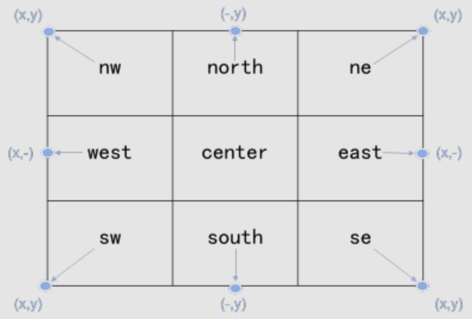

# Image Processing Parameters

## 1. Image Processing Parameters

- Slash `/` separates different actions;
- Comma `,` separates different parameters within an action;
- Underscore `_` separates key and value in `key_value` form;
- When `value` is complex, use `base64url_encode`; see each parameter's description for whether encoding is required;

### 1.1 Image Save Parameters
| Parameter | Required | Description | Range |
| - |  - |  - |  - |
| format | No | Format conversion | jpeg<br>png<br>webp |
| quality | No | Quality adjustment | [1,100]<br>Default: `settings.PROCESSOR_DEFAULT_QUALITY` (75)<br>Supported for JPG and WebP |
| interlace | No | Progressive display | `0`: (default) standard display<br>`1`: progressive display |
| animation | No | Preserve animation | `0`: (default) do not preserve animation<br>`1`: preserve animation |

> Note: When multiple action keys are listed together, separate them with `/`. From section 1.2 onward, each section describes a single action.

Examples:

- `format,webp` — WebP can reduce file size;
- `format,png` — use PNG when transparency is needed;
- `interlace,1/quality,70/format,jpeg` — JPEG with quality 70 and progressive display


### 1.2 Resize `resize`
| Parameter | Required | Description | Range |
| - |  - |  - |  - |
| m | No | Resize mode; takes effect only when `w` or `h` is set | `lfit` (default) proportional resize, image fits within the specified w×h rectangle<br>`mfit` proportional resize, smallest image that extends beyond the specified w×h rectangle<br>`fit` proportionally scale to the smallest size extending beyond the w×h rectangle, then center-crop the overflow<br>`pad` scale to the largest image within the w×h rectangle, then pad with the specified color<br>`fixed` fixed width and height, forced scaling<br>See enum [ResizeMode](#resizemode) |
| w | No | Target width | [1, `settings.PROCESSOR_MAX_W_H`] |
| h | No | Target height | [1, `settings.PROCESSOR_MAX_W_H`] |
| l | No | Target longest side; lower priority than `w`, `h` | [1, `settings.PROCESSOR_MAX_W_H`] |
| s | No | Target shortest side; lower priority than `l` | [1, `settings.PROCESSOR_MAX_W_H`] |
| p | No | Scale by percentage; lower priority than `s` | [1, 1000]<br>Below 100 shrinks; above 100 enlarges |
| limit | No | Whether to scale when target resolution exceeds source resolution | `1` (default) do not upscale<br>`0` scale according to the specified parameters |
| color | No | Fill color; only valid when `m=pad` | Default: FFFFFF (white)<br>Supports 3-, 4-, 6-, or 8-digit hex color codes |

 Note: `settings.PROCESSOR_MAX_W_H` defaults to `30000`.

Examples:

- `resize,m_fixed,w_1000,h_1000,l_700` — `l` has lower priority and is ignored; a 1980×1080 source is forced to 1000×1000


### 1.3 Crop `crop`
| Parameter | Required | Description | Range |
| - |  - |  - |  - |
| x | No | Crop start x-coordinate (origin at top-left by default) | [0, image boundary], default 0 |
| y | No | Crop start y-coordinate | [0, image boundary], default 0 |
| w | No | Target width | [1, image width], default maximum |
| h | No | Target height | [1, image height], default maximum |
| ratio | No | Compute target width/height from source aspect ratio;<br>higher priority than `w`, `h` | Format: `w:h`, e.g. `4:3` |
| g | No | Crop by nine-grid position | See diagram below |
| pf | No | Compute the corresponding `xywh` fields as percentages;<br>when set, those fields use range [0,100];<br>ignored when `g` is set | Any combination of the 4 letters `xywh` |
| padr | No | Crop from the right edge | [0, image width]; no crop if unset |
| padb | No | Crop from the bottom edge<br>(left and top crops are controlled by x, y) | [0, image height]; no crop if unset |



Examples:

- `crop,ratio_4:3,g_center` — a 500×300 source is center-cropped to 400×300
- `crop,x_25,y_25,w_50,h_50,pf_xywh` — a 500×400 source is center-cropped to 250×200 using percentage fields
- `crop,x_10,y_10,padr_10,padb_10` — crop 10 pixels from all four sides


### 1.4 Rounded Corners `circle`
| Parameter | Required | Description | Range |
| - |  - |  - |  - |
| r | No | Corner radius for rounded corners;<br>if unset or larger than the maximum inscribed circle, the maximum inscribed radius is used | [1, image boundary] |

> Note: Usually combined with `format,png`; otherwise there is no transparency.

Examples:

- `circle/format,png` — without `r`, an 800×800 source becomes a circle at 800×800;
- `circle,r_10/format,png` — an 800×800 source gets corners with radius 10;
- `circle,r_1000/format,png` — an 800×800 source with `r` exceeding bounds outputs a circular image;


### 1.5 Blur `blur`
| Parameter | Required | Description | Range |
| - |  - |  - |  - |
| r | Yes | Gaussian blur radius; larger values produce more blur | [1, 512] |

Examples:

- `blur,r_2`


### 1.6 Rotate `rotate`
| Parameter | Required | Description | Range |
| - |  - |  - |  - |
| [value] | No | Clockwise rotation angle in degrees | [0,360]<br>Default: 0 (no rotation) |

> Note: This action has no key; put the value directly after the comma.

Examples:

- `rotate` is equivalent to `rotate,0` (no rotation)
- `rotate,90` rotates the image 90° clockwise
- `rotate,45` rotates 45° clockwise and changes the aspect ratio


### 1.7 Opacity `alpha`
| Parameter | Required | Description | Range |
| - |  - |  - |  - |
| [value] | No | Image opacity | [0,100]<br>Default: 100 (fully opaque) |

> Note: This action has no key; put the value directly after the comma. For non-PNG sources, combine with `format,png`.

Examples:

- `alpha` is equivalent to `alpha,100` (fully opaque)
- `alpha,0` makes the image fully transparent
- `alpha,50/format,png` sets 50% opacity


### 1.8 Grayscale `gray`

No parameters.

Examples:

- `gray` converts the image to grayscale
- `gray/format,jpeg/quality,75` is often combined with JPEG conversion and quality settings to reduce file size (optional)


### 1.9 Watermark `watermark`
| Parameter | Required | Description | Range |
| - |  - |  - |  - |
| x | No | Watermark start x-coordinate on the source image | [0, image boundary]<br>Default `10` |
| y | No | Watermark start y-coordinate on the source image | [0, image boundary]<br>Default `10` |
| g | No | Position watermark by nine-grid; higher priority than `x`, `y` | |
| pf | No | Compute the corresponding `xy` fields as percentages;<br>when set, those fields use range [0,100];<br>ignored when `g` is set | Any combination of the 2 letters `xy` |
| fill | No | Tile watermark across the entire image | `0` (default) do not tile<br>`1` tile across the image |
| padx | No | Horizontal spacing between tiled watermarks; only when tiling is enabled | [0,4096], default `0` |
| pady | No | Vertical spacing between tiled watermarks; only when tiling is enabled | [0,4096], default `0` |
| image | Yes | Image watermark file path; must be [base64url_encode](#base64url_encode) encoded |
| text | Yes | Text watermark content; either `text` or `image` is required<br>Must be [base64url_encode](#base64url_encode) encoded | Max length 64 characters before encoding |
| font | No | Font file path; must be [base64url_encode](#base64url_encode) encoded | |
| color | No | Text color | Default: 000000 (black)<br>Supports 3- or 6-digit hex color codes |
| size | No | Font size | [1, 1000]<br>Default: 40 |
| shadow | No | Text shadow opacity | [0,100]<br>Default: 0 (no shadow) |
| rotate | No | Clockwise rotation angle for the watermark | [0,360]<br>Default: 0 (no rotation) |
| order | No | Stacking order of text and image watermarks | 0 (default): image watermark left/above<br>1: text watermark left/above<br>see [PositionOrder](#positionorder) |
| align | No | Alignment of text and image watermarks | 0: top-aligned<br>1: center-aligned<br>2 (default): bottom-aligned<br>3: vertical left-aligned<br>4: vertical center-aligned<br>5: vertical right-aligned<br>see [PositionAlign](#positionalign) |
| interval | No | Spacing between text and image watermarks | [0,1000], default 0; unit: px |
| t | No | Watermark opacity | [0, 100]; 100 is fully opaque |
| design | No | Reference design size for watermark dimensions;<br>`design=1000` means the watermark was designed for a 1000px short side;<br>watermark is scaled according to the ratio between the source image and `design` | [1, `settings.PROCESSOR_MAX_W_H`]<br>When design=1000, if the watermark is 100×100 and the source is 1080×720, the watermark is scaled to 72×72 |

Examples:

- `watermark,text_SGVsbG8g5LiW55WM,color_FFFFFF,size_80` — text watermark where `SGVsbG8g5LiW55WM` is the encoded form of `Hello 世界`


### 1.10 Merge `merge`
| Parameter | Required | Description | Range |
| - |  - |  - |  - |
| image | Yes | Path to the image to merge; must be [base64url_encode](#base64url_encode) encoded | |
| actions | No | Pre-process `image` with string parameters; must be [base64url_encode](#base64url_encode) encoded |
| bg | No | Whether to treat `image` as background beneath the input image; defines merge order | `0` (default) no; order is (input image, image); `1` yes; order is (image, input image) |
| p | No | Scale `image` by percentage of the input image; when bg=1, scale the input image relative to `image` | [1, 1000]<br>Below 100 shrinks; above 100 enlarges |
| order | No | Stacking order of the input image and `image` | 0: `image` right/below<br>1: `image` left/above<br>`align` and `interval` have no effect if this is unset<br>see [PositionOrder](#positionorder) |
| align | No | Alignment of the input image and `image` | 0: top-aligned horizontally<br>1: center-aligned horizontally<br>2 (default): bottom-aligned horizontally<br>3: left-aligned vertically<br>4: center-aligned vertically<br>5: right-aligned vertically<br>see [PositionAlign](#positionalign) |
| interval | No | Spacing between the input image and `image` | [0,1000], default: 0; unit: px |
| g | No | Position by nine-grid; higher priority than `x`, `y` | |
| x | No | Start x-coordinate of `image` on the canvas | [0, image boundary]<br>Default `0` |
| y | No | Start y-coordinate of `image` on the canvas | [0, image boundary]<br>Default `0` |
| pf | No | Compute the corresponding `xy` fields as percentages;<br>when set, those fields use range [0,100];<br>ignored when `g` is set | Any combination of the 2 letters `xy` |
| color | No | Fill color for expanded areas after merge | Default: 0000 (transparent)<br>Supports 3-, 4-, 6-, or 8-digit hex color codes |

> Note: When `bg` is `1`, parameters after `order` specify the position/values of the input image on `image`.

Examples:

- `merge,image_dGVzdHMvaW1ncy9sZW5uYS00MDB4MjI1LmpwZw,g_ne,color_FFFF/format,png` — `image` is the encoded form of `tests/imgs/lenna-400x225.jpg`; `FFFF` means fully transparent fill


## 2. Image Processing Functions

### `process_image`

```python
process_image(
    input_uri: str,
    params: Union[ProcessParams, dict, str],
    out_path: Optional[str] = None,
    **kwargs,
) -> Optional[ByteString]
```

Process an image.

| Parameter | Type | Description |
| --- | --- | --- |
| `input_uri` | `str` | Path or URL to the input image |
| `params` | `ProcessParams / dict / str` | Image processing parameters |
| `out_path` | `str` (optional) | Path to save the output image |
| `**kwargs` | | Additional keyword arguments passed through to `Image.save` |

**Raises**: `ProcessLimitException` when processing limits are exceeded.

**Returns**: `None` by default when saving to disk; returns binary content of the processed image only when `out_path` is empty.

---

### `process_image_obj`

```python
process_image_obj(
    ori_im: ImageFile,
    params: Union[ProcessParams, dict, str],
    out_path: Optional[str] = None,
    **kwargs,
) -> Optional[ByteString]
```

Process a Pillow `Image` object directly. Parameters and return value are the same as `process_image`, except `ori_im` accepts an already-opened Image object.

---

### `extract_main_color`

```python
extract_main_color(img_path: str, delta_h: float = 0.3) -> str
```

Extract the dominant color of an image.

| Parameter | Type | Description |
| --- | --- | --- |
| `img_path` | `str` | Path to the input image |
| `delta_h` | `float` | Hue difference threshold; only pixels whose hue differs from the average hue by less than this value are used; range [0, 1] |

**Returns**: Hex color string, e.g. `"FFFFFF"`.

---

### `base64url_encode`

```python
base64url_encode(value: str) -> str
```

Perform URL-safe Base64 encoding:

- Replace `+` with `-`
- Replace `/` with `_`
- Strip trailing `=` padding

| Parameter | Type | Description |
| --- | --- | --- |
| `value` | `str` | Input string |

**Returns**: Encoded string.

---

### `base64url_decode`

```python
base64url_decode(value: str) -> str
```

Decode a URL-safe Base64 encoded string.

| Parameter | Type | Description |
| --- | --- | --- |
| `value` | `str` | Encoded string |

**Returns**: Decoded string.

---

### Exceptions

| Exception | Parent | Description |
| --- | --- | --- |
| `ProcessException` | `Exception` | Base exception for image processing |
| `ProcessLimitException` | `Exception` | Image processing limit exceeded (file size / pixel count) |
| `ParamParseException` | `ProcessException` | Parameter parsing error |
| `ParamValidateException` | `ProcessException` | Parameter validation error |

---

### Enums

#### `OpAction` — Supported operation types

| Name | Key | Description |
| --- | --- | --- |
| `RESIZE` | `resize` | Resize |
| `CROP` | `crop` | Crop |
| `CIRCLE` | `circle` | Rounded corners |
| `BLUR` | `blur` | Blur |
| `ROTATE` | `rotate` | Rotate |
| `ALPHA` | `alpha` | Opacity |
| `GRAY` | `gray` | Grayscale |
| `WATERMARK` | `watermark` | Watermark |
| `MERGE` | `merge` | Merge images |

#### <a id="resizemode"></a>`ResizeMode` — Resize modes

| Name | Key | Description |
| --- | --- | --- |
| `LFIT` | `lfit` | Scale proportionally to fit within the given w×h rectangle |
| `MFIT` | `mfit` | Scale proportionally to cover the given w×h rectangle |
| `FIT` | `fit` | Scale proportionally to cover the rectangle, then center-crop the overflow |
| `PAD` | `pad` | Scale proportionally to fit within the rectangle, then pad with the given color |
| `FIXED` | `fixed` | Fixed width and height; force scale to exact dimensions |

#### `Geography` — Nine-grid positions

| Name | Key | Description |
| --- | --- | --- |
| `NW` | `nw` | Top-left |
| `NORTH` | `north` | Top-center |
| `NE` | `ne` | Top-right |
| `WEST` | `west` | Middle-left |
| `CENTER` | `center` | Center |
| `EAST` | `east` | Middle-right |
| `SW` | `sw` | Bottom-left |
| `SOUTH` | `south` | Bottom-center |
| `SE` | `se` | Bottom-right |

#### <a id="positionorder"></a>`PositionOrder` — Element ordering

| Name | Value | Description |
| --- | --- | --- |
| `BEFORE` | `0` | First input element before / on top |
| `AFTER` | `1` | First input element after / below |

#### <a id="positionalign"></a>`PositionAlign` — Alignment

| Name | Value | Description |
| --- | --- | --- |
| `TOP` | `0` | Align to top horizontally |
| `HORIZONTAL_CENTER` | `1` | Align to horizontal center |
| `BOTTOM` | `2` | Align to bottom horizontally |
| `LEFT` | `3` | Align to left vertically |
| `VERTIAL_CENTER` | `4` | Align to vertical center |
| `RIGHT` | `5` | Align to right vertically |

#### `ImageFormat` — Image formats

| Name | Value | Description |
| --- | --- | --- |
| `JPEG` | `JPEG` | JPEG format |
| `PNG` | `PNG` | PNG format |
| `WEBP` | `WEBP` | WebP format |
